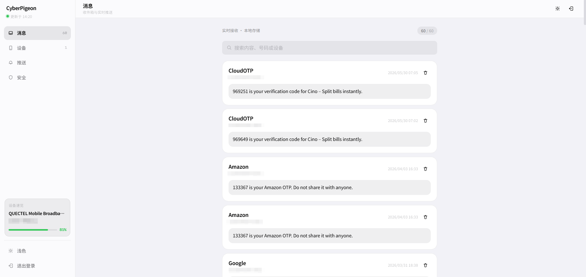

# CyberPigeon

一个简单的短信转发工具，基于 ModemManager 开发，支持将短信转发到多种通知渠道。

## 界面预览



## 功能特性

- 支持多种转发通道：Email, Bark, Gotify, ServerChan3, 企业微信，钉钉，飞书，Telegram,Webhook。
- 提供 Web 管理界面（Next.js 静态导出，由 Go 二进制内嵌托管），支持查看短信列表和设备状态。
- 支持 USSD 代码执行（如查询话费）。
- 适配 Linux x64 和 Linux ARM64 平台。

## 已测试设备

- Sierra Wireless AirPrime® EM7430
- Qualcomm Snapdragon® 410 UFI (UFI-001C,UFI003等)
- DJI USB 4G Modem (Quectel EC25 Modules)

## 编译方法

### 后端（Go）

```bash
# 编译 Linux ARM64 版本
GOOS=linux GOARCH=arm64 go build -o CyberPigeon-linux-arm64
```

### 前端（Next.js）

Web 控制台源码在 `web/`，构建后同步到 `internal/server/web/` 供 Go `embed` 打包：

```bash
cd web
npm install
npm run export:go
cd ..
go build -o CyberPigeon
```

开发时可用：

```bash
cd web
npm run dev
# 另开终端启动后端，或通过 next.config 代理 /api 与 /ws
```

## 配置说明

1. 将 `config.example.toml` 重命名为 `config.toml`。
2. 编辑 `config.toml` 文件，配置短信转发通道和相关参数。

## 文档

- API 用例文档：[docs/api-examples.md](docs/api-examples.md)

## 运行

直接运行编译后的二进制文件：

```bash
./CyberPigeon-linux-arm64
```

如忘记 Web 管理密码，可直接在 shell 中执行：

```bash
./CyberPigeon-linux-arm64 --reset-password 新密码
```

如需避免密码出现在 shell 历史或进程参数中，建议改用安全输入模式：

```bash
./CyberPigeon-linux-arm64 --reset-password -
```

随后程序会提示你在终端中输入新密码；也可以通过标准输入传入。

执行后会：
- 直接重置管理密码
- 清空所有现有登录会话
- 程序执行完成后立即退出

程序默认监听端口可在配置文件中修改。若关闭存储功能，Web 管理认证不可用，程序会强制 Web 服务仅监听本机地址，避免管理接口暴露到局域网或公网。

常用接口调用示例见 [docs/api-examples.md](docs/api-examples.md)。

## 注意事项

- 程序依赖 ModemManager，请确保运行环境已安装并运行 ModemManager 服务。
- 请确保有足够的权限访问 DBus 系统总线。
